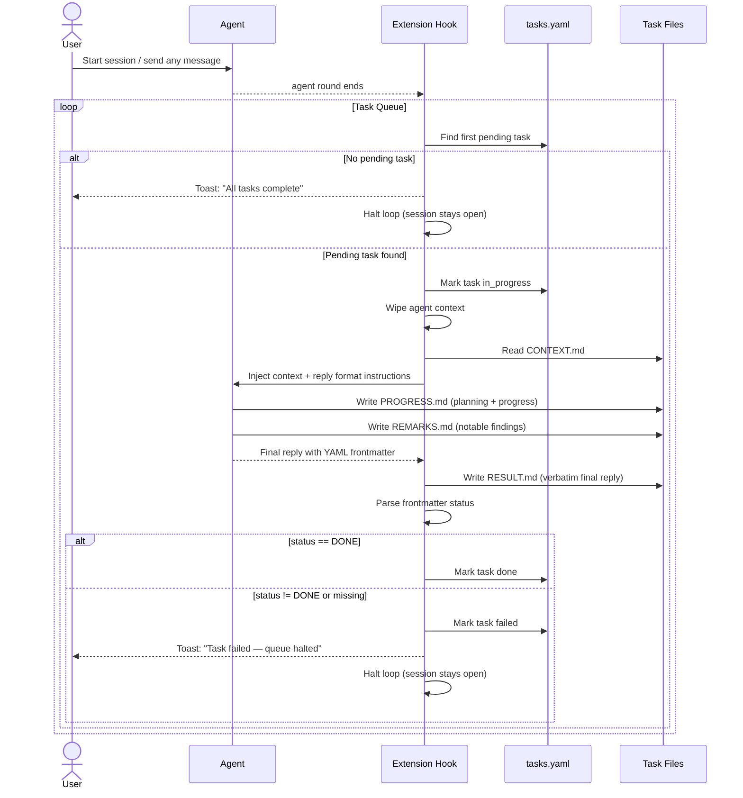

# PRD: Stay Focused — MVP

## Overview

Stay Focused is a project-local Pi Coding Agent extension that enables sequential, autonomous task execution. It maintains a task list, detects when an agent finishes a task, reads the agent's structured reply to determine success or failure, and automatically loads the next pending task into a fresh context — looping until no pending tasks remain.

---

## Problem

Pi sessions are interactive and stateful. Running multiple distinct tasks requires the user to manually clear context, load new task instructions, and track which tasks have been completed. This is tedious and error-prone for sequences of related but independent coding tasks.

---

## Goals

- Allow a user to define a queue of tasks upfront and walk away
- Automatically advance through pending tasks without user intervention
- Fail closed: any ambiguous or missing status signal is treated as failure
- Keep full traceability: every task produces a written record of its outcome
- Keep the agent unaware of the task queue mechanism; it only needs to know its current task files and output conventions

---

## Non-Goals (MVP)

- No parallel task execution
- No task dependency graph
- No automatic task creation by agents
- No global (cross-project) task runner
- No retry logic on failure
- No rich notification — toast messages only

---

## Task Directory Structure

All task artifacts live under `tasks/` at the project root.

```
tasks/
  tasks.yaml
  001_task-name/
    CONTEXT.md
    PROGRESS.md
    REMARKS.md
    RESULT.md
  002_another-task/
    ...
```

### `tasks.yaml`

Machine-managed task registry. The extension reads and writes this file; the agent never interacts with it directly.

```yaml
tasks:
  - id: "001"
    name: "task-name"
    status: pending   # pending | in_progress | done | failed
  - id: "002"
    name: "another-task"
    status: pending
```

Status transitions managed by the extension:
- `pending` → `in_progress` when task is loaded into agent
- `in_progress` → `done` when agent reply contains `status: DONE` in YAML frontmatter
- `in_progress` → `failed` for all other cases (missing frontmatter, wrong value, agent error)

### `CONTEXT.md`

Created by the user before running the task queue. Contains:
- Task requirements and constraints
- Reference links or file paths
- Verification steps (manual or automated)

Injected verbatim into the agent's context at task start.

### `PROGRESS.md`

The agent's working notebook. The agent is instructed to use this file to plan subtasks and track progress as it works. Written and updated by the agent during execution. Preserved as-is after task completion or failure.

### `REMARKS.md`

Written by the agent to record notable deviations from the original task intention, unexpected findings, or decisions worth documenting for the human reviewer.

### `RESULT.md`

Written by the extension (not the agent) after each agent round ends. Contains the agent's final response verbatim — including the YAML frontmatter status signal. Serves as the permanent outcome record.

---

## Agent Reply Convention

The agent is instructed via its injected context to end its final response with a YAML frontmatter block:

```
---
status: DONE
message: Brief summary of what was accomplished.
---
```

Or on failure:

```
---
status: FAILED
message: What went wrong and why the task could not be completed.
---
```

The extension parses the frontmatter from the agent's last assistant message. Rules:
- If frontmatter is present and `status` equals `DONE` (case-sensitive): task is marked `done`
- All other cases — missing frontmatter, `status: FAILED`, any other value, malformed block — task is marked `failed`

The extension writes the full last assistant message to `RESULT.md` regardless of parse outcome.

---

## Extension Behavior

### Placement

Project-local, active only when Pi is run from this project.

### Loop Sequence



### Context Injection

Before the agent starts on a task, the extension sends a user message containing:
1. The full content of `CONTEXT.md`
2. Paths to `PROGRESS.md` and `REMARKS.md` with instructions on their purpose
3. The required reply format (YAML frontmatter with `status` and `message`)

The agent is not told about `tasks.yaml` or `RESULT.md`.

### Failure Handling

On task failure, the extension marks the task `failed`, toasts the user, and halts the queue. No retry. The user reviews `RESULT.md` and `REMARKS.md` manually to determine next steps before restarting.

---

## Implementation Components

| Component | Description |
|---|---|
| `index.ts` | Extension entry point; wires all event handlers |
| `task-store.ts` | Read/write interface for `tasks.yaml` |
| `context-builder.ts` | Assembles the injection message from task files |
| `result-writer.ts` | Writes `RESULT.md` and parses frontmatter status |
| `loop-controller.ts` | Orchestrates the loop: pick next task, wipe context, inject, trigger |
